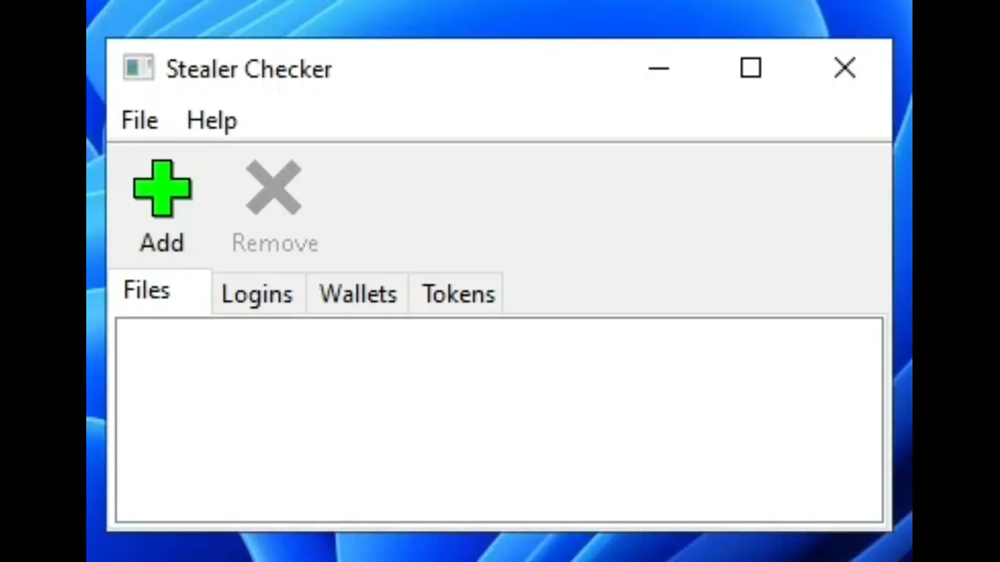

<h3 align="center">Stealer Checker</h3>
<p align="center">Get information from RedLine logs.</p>

## Demonstration


## Requirements
- GCC v8.3.0
- wxWidgets v3.1.5
- Mimaxue v4.5.3
- cJSON v1.7.15

## Installation
```git clone https://github.com/r3ady4anyth1ng/Stealer-Checker.git```

## License
Distributed under the Unlicense. See [LICENSE](LICENSE) for more information.
